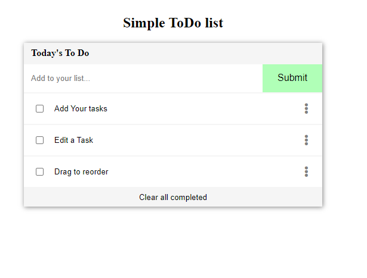

# Simple To Do List

> One paragraph statement about the project.

Additional description about the project and its features.

## Built With

- HTML, CSS and JavaScript

## Live Demo

[Live Demo Link](https://lino09.github.io/todo-list/)

## Getting Started

To get a local copy up and running follow these simple example steps.

### You need NPM installed in your comnputer

### clone the repo

### Run the following commands

> cd todo-list  
 npm install  
 npm run build  
 npm run start

### It will run in your http://localhost:8080/

## Authors

👤 **Abel Herrera**

- GitHub: [@Lino09](https://github.com/Lino09)
- Twitter: [@AbelHerreaZam1](https://twitter.com/AbelHerreaZam1)

## 🤝 Contributing

Contributions, issues, and feature requests are welcome!

Feel free to check the [issues page](../../issues/).

## Show your support

Give a ⭐️ if you like this project!

## Acknowledgments

- Microverse

## 📝 License

This project is Free to use
